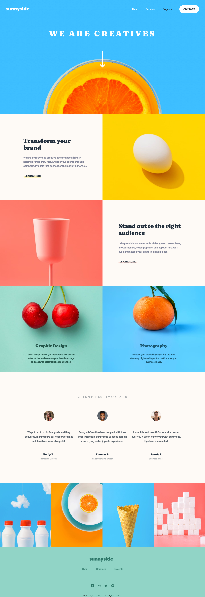

# Frontend Mentor - Sunnyside agency landing page solution

This is a solution to the [Sunnyside agency landing page challenge on Frontend Mentor](https://www.frontendmentor.io/challenges/sunnyside-agency-landing-page-7yVs3B6ef). Frontend Mentor challenges help you improve your coding skills by building realistic projects.

## Table of contents

- [Overview](#overview)
  - [The challenge](#the-challenge)
  - [Screenshot](#screenshot)
  - [Links](#links)
- [My process](#my-process)
  - [Built with](#built-with)
  - [Useful resources](#useful-resources)
- [Author](#author)

## Overview

### The challenge

Users should be able to:

- View the optimal layout for the site depending on their device's screen size
- See hover states for all interactive elements on the page

### Screenshot

### Links

- Solution URL: [https://www.frontendmentor.io/solutions/sunnyside-agency-landing-page-using-flexbox-and-css-grid-JsCrgmsYQ#comment-61ec261d6d859468049dccb7](https://www.frontendmentor.io/solutions/sunnyside-agency-landing-page-using-flexbox-and-css-grid-JsCrgmsYQ#comment-61ec261d6d859468049dccb7)
- Live Site URL: [https://nakoyawilson.github.io/sunnyside-agency-landing-page/](https://nakoyawilson.github.io/sunnyside-agency-landing-page/)

## My process

### Built with

- HTML
- CSS
- JavaScript
- Flexbox
- CSS Grid

### Useful resources

- [Remove white space below image - Stack Overflow](https://stackoverflow.com/questions/7774814/remove-white-space-below-image)

## Author

- Website - [Nakoya Wilson](https://nakoyawilson.netlify.app/)
- Frontend Mentor - [@nakoyawilson](https://www.frontendmentor.io/profile/nakoyawilson)
- Twitter - [@nakoyawilson](https://twitter.com/nakoyawilson)
- LinkedIn - [@nakoyawilson](https://www.linkedin.com/in/nakoyawilson/)
